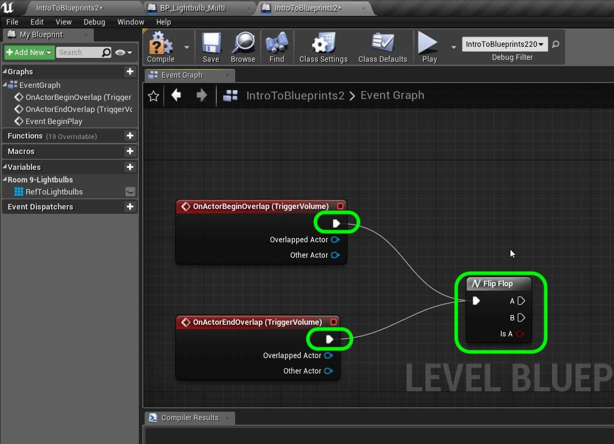
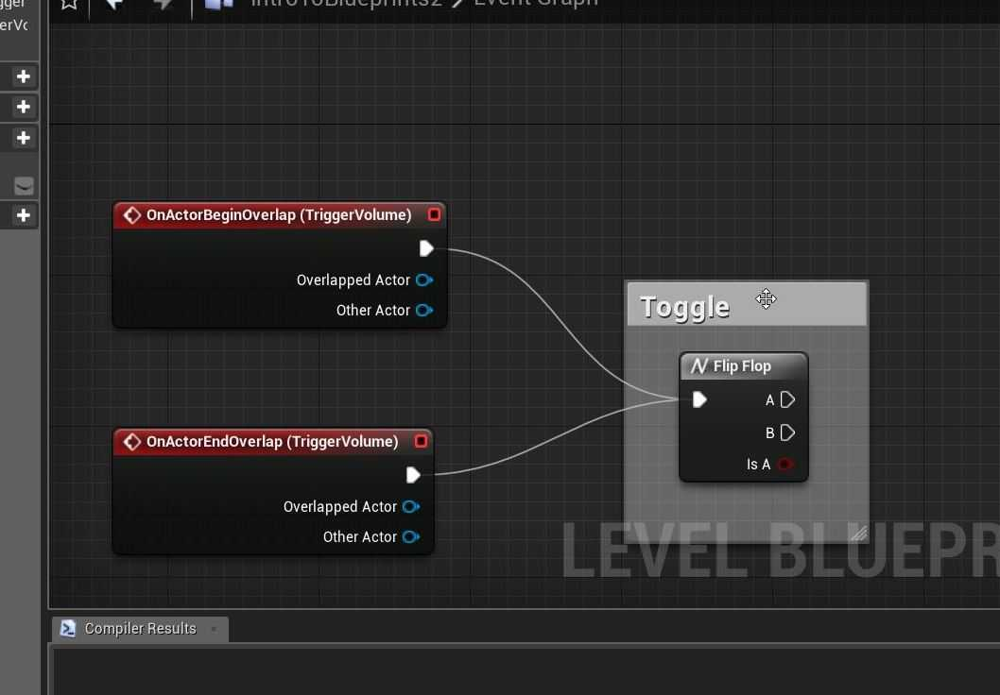
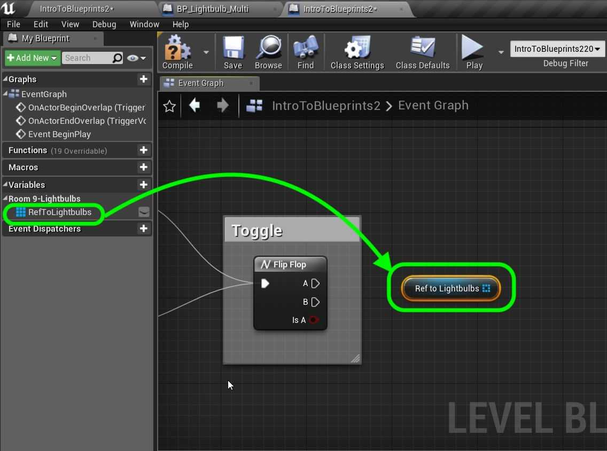
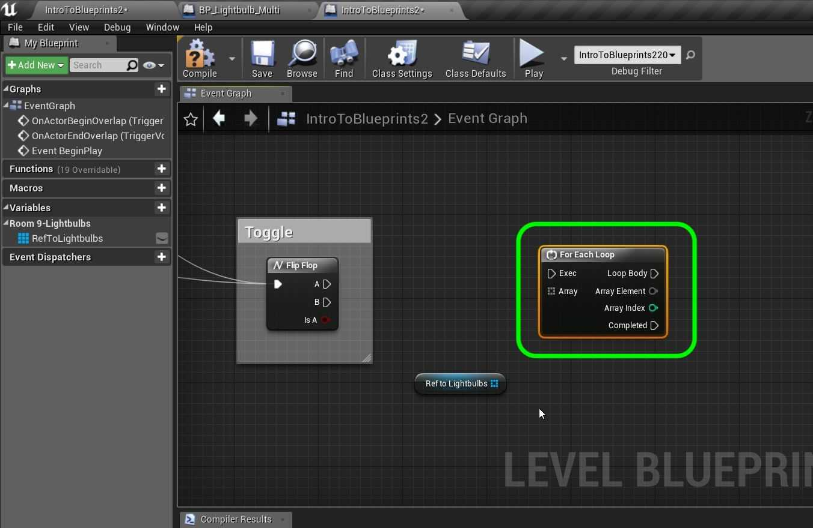
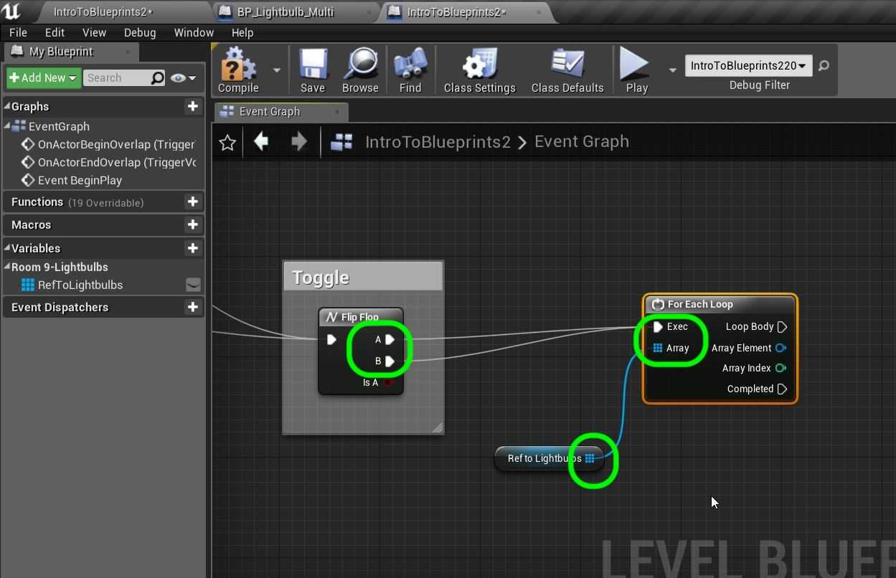
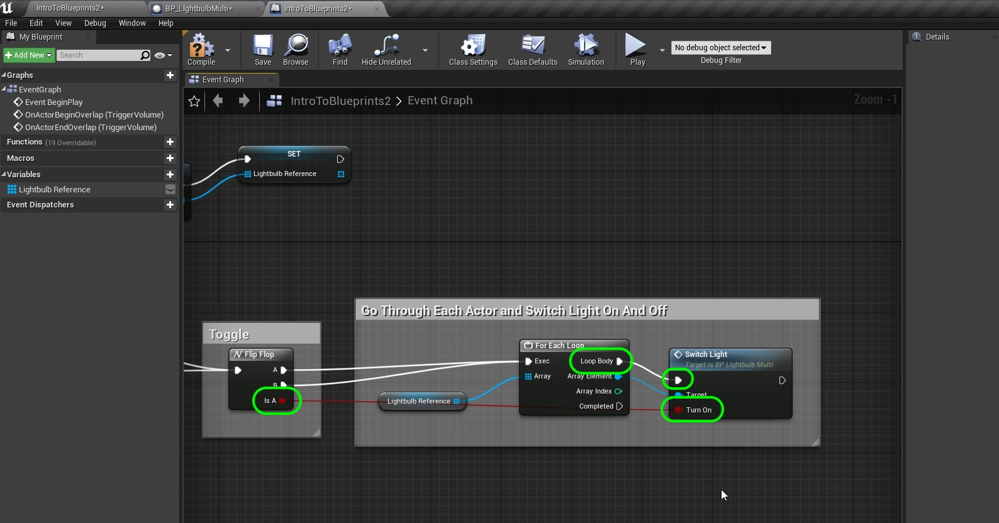
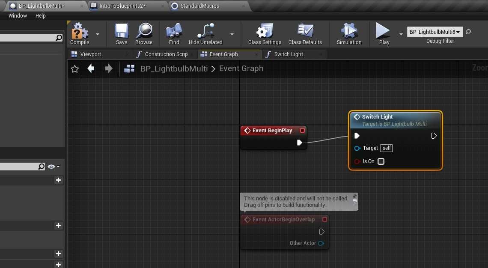
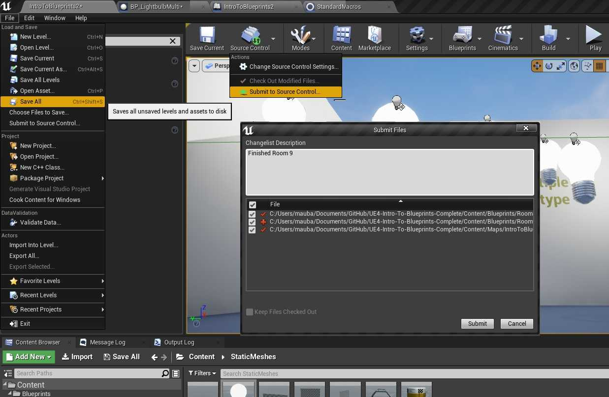

### Dynamically Alter Multiple Classes II

[previous](../multiple-actors/README.md#user-content-dynamically-alter-multiple-classes) • [home](../README.md#user-content-ue4-blueprints) • [next](../interface/README.md#user-content-communicate-through-interface)

Controlling multiple actors through level blueprints continued...

 

---

##### `Step 1.`\|`ITB`|:small_blue_diamond:

Connect the execution pins from **Begin Play** to **Get All Actors of Class**. Select the actor you want to get from the level `BP_LightbulbMulti`. Now drag a copy of **Set Lightbulb Reference** and connect the output array pin to the input array pin of these nodes as shown.

##### `Step 2.`\|`FHIU`|:small_blue_diamond: :small_blue_diamond: 

Make sure you still have the trigger volume selected in the editor. Right click on the graph and see that we can now access events to this game object. Select **Add Event for Trigger Volume 1 | Collision | Add on Actor Begin Overlap** AND a **Add Event for Trigger Volume 1 | Collision | Add on Actor End Overlap** node. This will trigger the nodes when an actor enters and leaves the volume.

##### `Step 3.`\|`ITB`|:small_blue_diamond: :small_blue_diamond: :small_blue_diamond:

*Add* a **Flip Flop** node to the chart. This node when triggered toggles between true and false. Connect it to both the **Overlap** nodes. This way the first time you enter the volue it will switch on, then when you leave swtich off. This will continue this behavior during the game. What will happen is that the **IsA** boolean on the **Flip Flop** pin will change from **True** to **False** and back.

##### `Step 4.`\|`ITB`|:small_blue_diamond: :small_blue_diamond: :small_blue_diamond: :small_blue_diamond:

Add a comment by pressing the <kbd>C</kbd> and call it `Toggle`.

##### `Step 5.`\|`ITB`| :small_orange_diamond:

*Drag* a copy of the **RefToLightbulbs** variable onto the graph.

##### `Step 6.`\|`ITB`| :small_orange_diamond: :small_blue_diamond:

How do we get access to each instance of each lightbulb in the array and not the entire array? We use a **For Each** loop. *Right click* and add a **For Each** Loop to the graph.

##### `Step 7.`\|`ITB`| :small_orange_diamond: :small_blue_diamond: :small_blue_diamond:

*Connect* the **A** and **B** execution pins from the **Flip Flop** node to the **E**xec pin in the **For Each Loop** node. *Connect* the output of the **RefToLightbulbs** node to the **Array** input pin in the **For Each Loop**.

##### `Step 8.`\|`ITB`| :small_orange_diamond: :small_blue_diamond: :small_blue_diamond: :small_blue_diamond:

*Pull off* of the **Array Element** pin and trigger the **Switch Light** function in each light. Conect the output of the **Flip Flop | Is A** node to the **Switch Light** node's **Is On** pin.

**IsA** gives the current state.  So every time the **Flip Flop** node is triggered this goes between **True** and **False**.  **IsA** outputs the switched state (so if it was **True** before and when triggered becomes **False**).

##### `Step 9.`\|`ITB`| :small_orange_diamond: :small_blue_diamond: :small_blue_diamond: :small_blue_diamond: :small_blue_diamond:

Go to **BP_LightbulbMulti** and the **Event Graph** *add* a **Switch Light** node and set it to `false` so that the lights ALWAYS start turned off.

##### `Step 10.`\|`ITB`| :large_blue_diamond:

Now run the game and enter and leave the room. The lights should toggle on and off.

##### `Step 11.`\|`ITB`| :large_blue_diamond: :small_blue_diamond: 

That's it for **Room 9**. *Press* **Save All** and update **Github** by committing and pushing all the changes made. Next up we will be using a broadcast event to access the on off switch on classes of different types.

___

| [previous](../multiple-actors/README.md#user-content-dynamically-alter-multiple-classes)| [home](../README.md#user-content-ue4-blueprints) | [next](../interface/README.md#user-content-communicate-through-interface)|
|---|---|---|
