### Dynamically Alter Multiple Classes

[previous](../translation/README.md#user-content-translation) • [home](../README.md#user-content-ue4-blueprints) • [next](../multiple-actors-ii/README.md#user-content-dynamically-alter-multiple-classes-ii)

Now you don't always have to assign the reference to the variable. You can access multiple instances of an object of the same class dynamically at run time as opposed to storing it in a variable at compile time. We can do this with a special node called **Get All Actors From Class**.

 

---

##### `Step 1.`\|`ITB`|:small_blue_diamond:

Add a `Blueprints | Room9` folder to your project. Press the <kbd>Add New</kbd> button and select **Blueprint Class**. Select type **Actor** class and call it `BP_LightbulbMulti`.

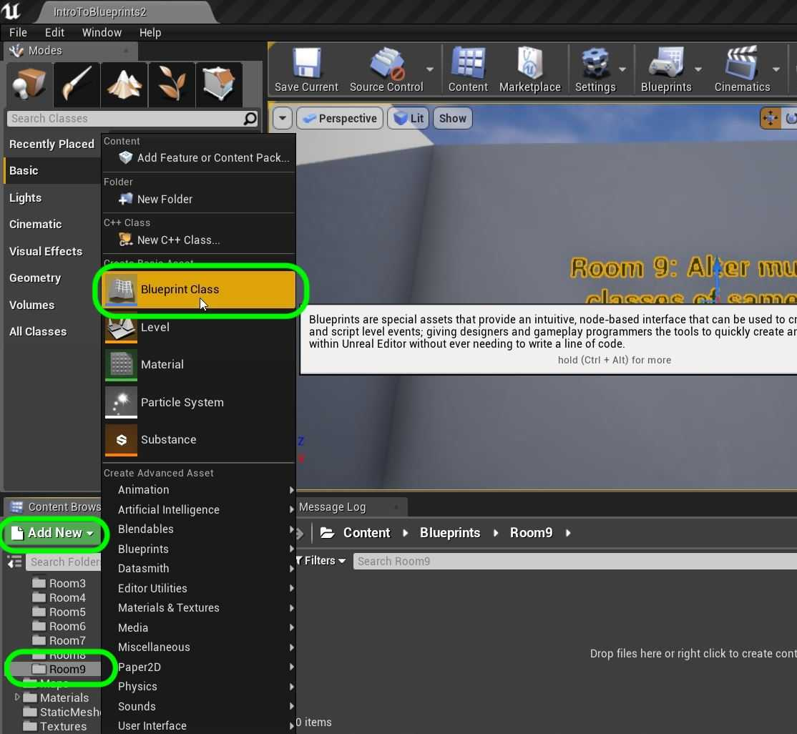

##### `Step 2.`\|`FHIU`|:small_blue_diamond: :small_blue_diamond: 

Open the new blueprint and *add* a new **Static Mesh** by *pressing* the **Add Component** button. Add a **Static Mesh** `Lightbulb`.

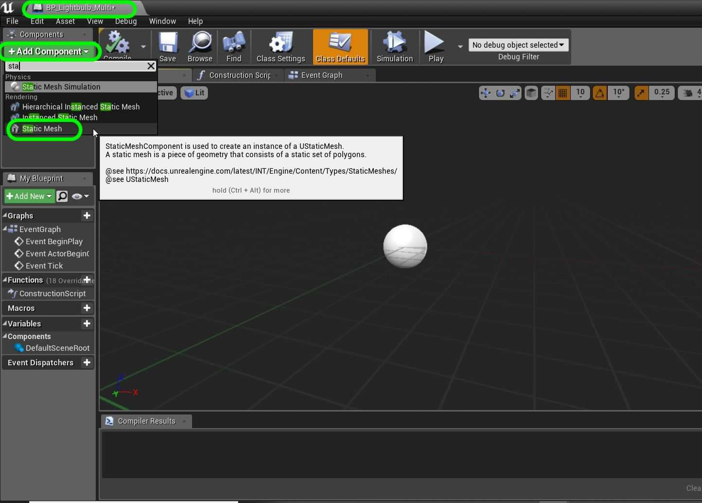

##### `Step 3.`\|`ITB`|:small_blue_diamond: :small_blue_diamond: :small_blue_diamond:

*Rename* static mesh component to `Lightbulb` and *drag* it on its parent making it the root object. *Change* the scale to `10.0` on the **X,Y & Z** axis.

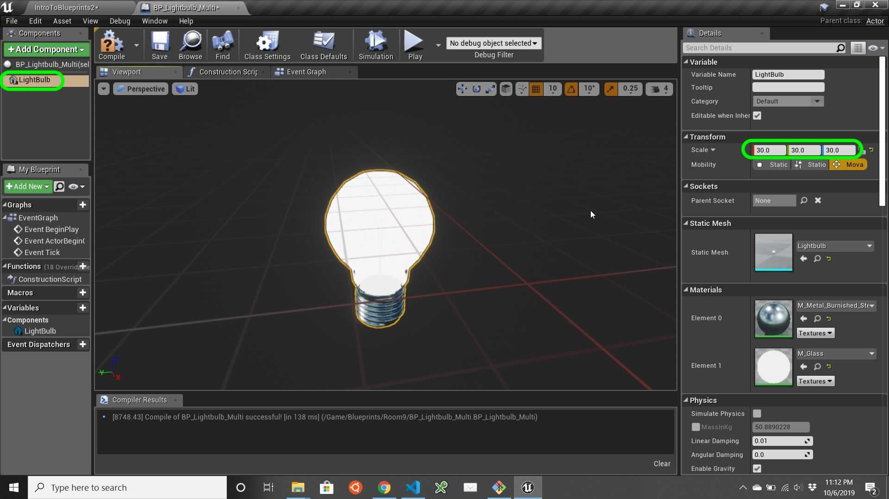

##### `Step 4.`\|`ITB`|:small_blue_diamond: :small_blue_diamond: :small_blue_diamond: :small_blue_diamond:

Scoot over to **Room 9** and *add* a whole bunch of lightbulbs in the room.

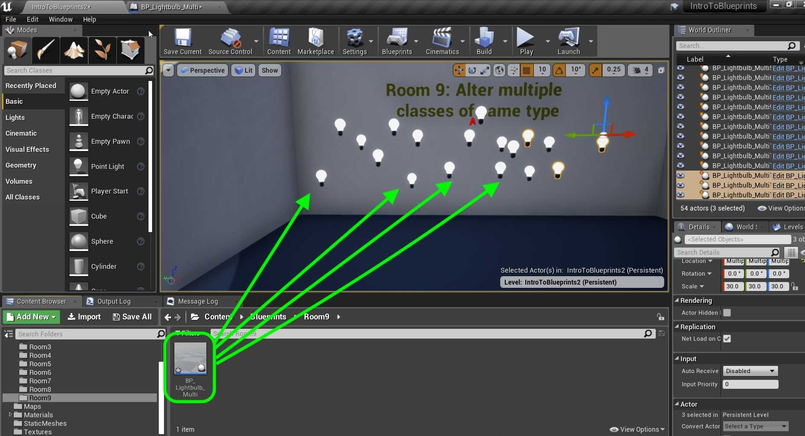

##### `Step 5.`\|`ITB`| :small_orange_diamond:

Open up **BP_Lightbulb**. Add a new component **Point Light** so that the bulbs actually light up the room. Make sure it is a child to the static mesh by dragging it over it. This way when you move the lightbult the light moves with it. Check that in the level it is casting light.

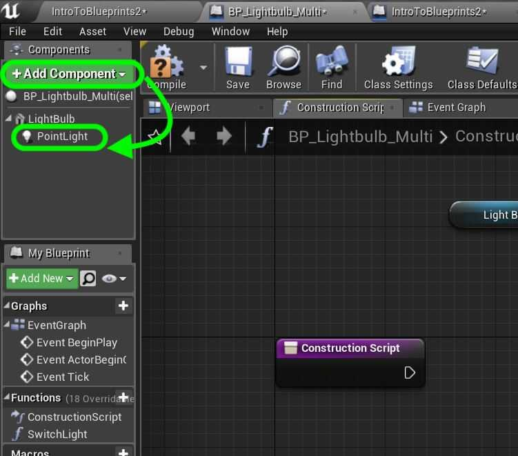

##### `Step 6.`\|`ITB`| :small_orange_diamond: :small_blue_diamond:

We need to add a dynamic materail to the **Construction Script**. To switch the light on and off we will need to turn the point light on and off as well as the material glow. Drag a reference of the **Lightbulb** static mesh onto the graph. Pull off the blue pin and select a **Create Dynamic Material** node.

##### `Step 7.`\|`ITB`| :small_orange_diamond: :small_blue_diamond: :small_blue_diamond:

*Add* a new **Variable** and call it `DynamicMaterial`. *Choose* variable type **Material Instance Dynamic | Object Reference**. *Add* a **Tooltip** that says `Holds reference to material`. Put it in category `Lightbulb` and make it `Private`. *Drag* a copy to the graph and plug the **Return Value** from the **Create Dynamic Material Node** to the input pin of the **Set DynamicMaterial Variable**.

##### `Step 8.`\|`ITB`| :small_orange_diamond: :small_blue_diamond: :small_blue_diamond: :small_blue_diamond:

*Connect* the execution pins from the **Construction** script node to the **Create Dynamic Material Instance** to the **Set Dynamic Material** nodes. Now the lightbulb's material with the glow is in **M_Glass**. *Select* the **Source Material** as `M_Glass` and set the **Element Index** to `1`.

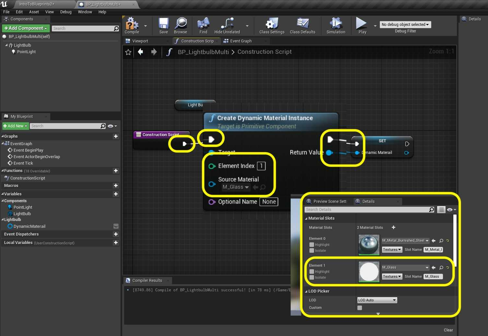

##### `Step 9.`\|`ITB`| :small_orange_diamond: :small_blue_diamond: :small_blue_diamond: :small_blue_diamond: :small_blue_diamond:

Press the **+** button next to **Functions** to add a new function. This allows us to put nodes in this blueprint that can be called from other objects. So intead of an internal event (BeginPlay or Tick) you can create your own function name and call it from another object.

Call this new function `SwitchLight`. We need to add an **Input** and call it `bIsOn`. Make it type **boolean**. Without this there is no way for the function to know if we are turning the light **on** or **off**. Notice that this adds a pin to the **Switch Light** execution pin.

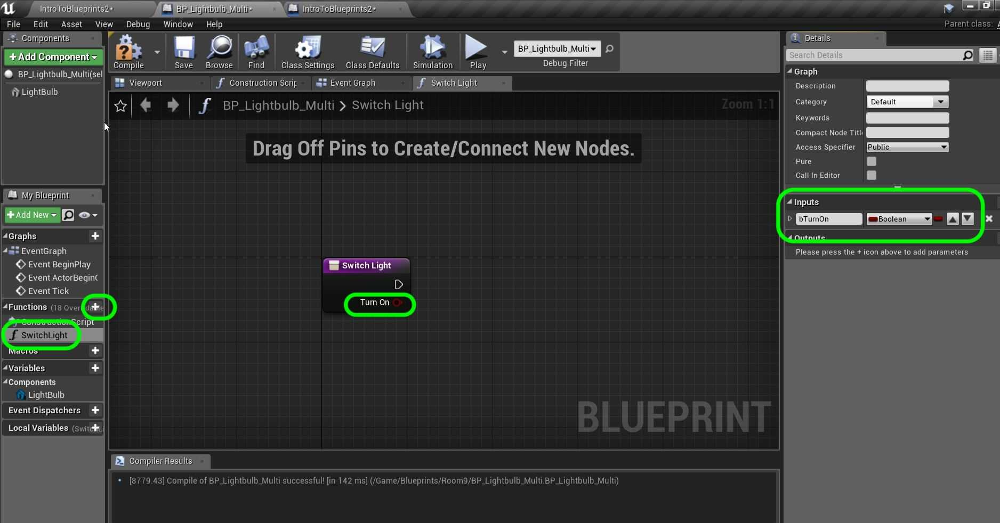

##### `Step 10.`\|`ITB`| :large_blue_diamond:

*Add* a **Branch Node** to the node graph. *Attach* the execution pins and the **Turn On** output pin from **Switch Light** to the input pin in the **Branch** Node. We will handle the turn on light logic from the **True** output pin and the turn off logic from the **False** pin.

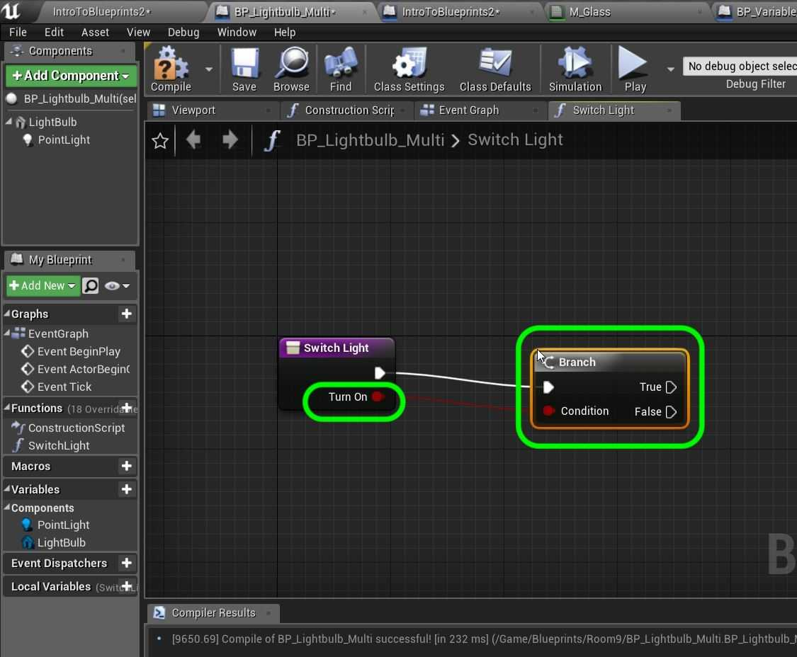

##### `Step 11.`\|`ITB`| :large_blue_diamond: :small_blue_diamond: 

*Click* on the **Point Light** in the **Components** menu. Lets look at the **Details** panel. A **Variable** called **Intensity** can be used to turn the acutal light on and off. We can set it to `0` when off and `5000` when on. Drag the **Point Light** to the graph and pull off its pin and select **Set Intensity** to change this value. Since this is for turning on set the **New Intensity** to `5000`.

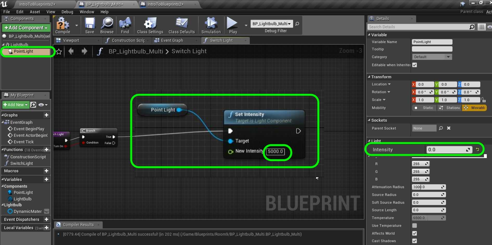

##### `Step 12.`\|`ITB`| :large_blue_diamond: :small_blue_diamond: :small_blue_diamond: 

Open up the **M_Glass** material. Look at what is going into the **Emissive Color** channel. We can use the **GlowMultiplier** Scalar Parameter to turn the glow on and off.

##### `Step 13.`\|`ITB`| :large_blue_diamond: :small_blue_diamond: :small_blue_diamond:  :small_blue_diamond: 

*Add* a reference to the **Dynamic Material** we just captured. *Pull off* the output pin and select **Set Scalar Parameter Value** and change the **Parameter Name** to `GlowMultiplier`. Make sure it is EXACTLY the same as the material. Set the **Value** to `6.0`. *Connect* the execution pins.

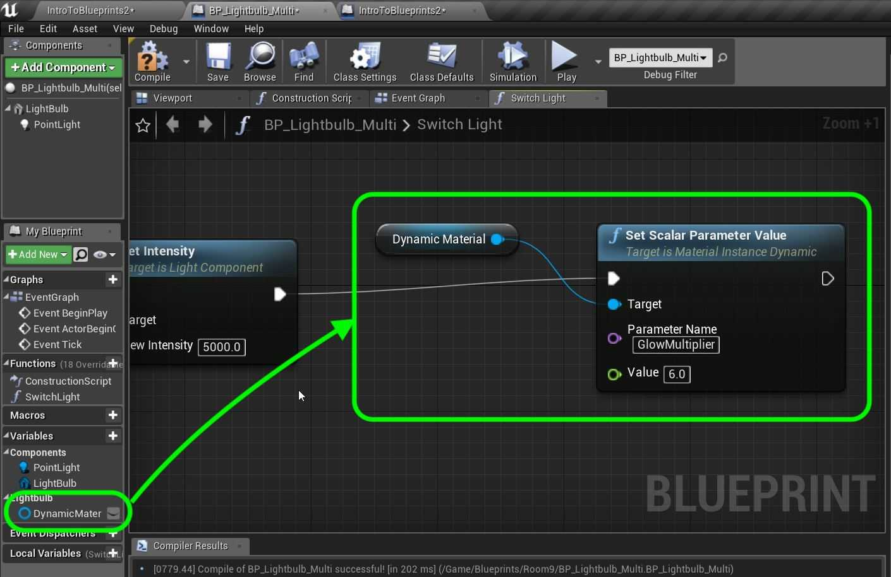

##### `Step 14.`\|`ITB`| :large_blue_diamond: :small_blue_diamond: :small_blue_diamond: :small_blue_diamond:  :small_blue_diamond: 

Add a `Turn Light On` comment by highlighting the nodes and pressing the <kbd>C</kbd> key.

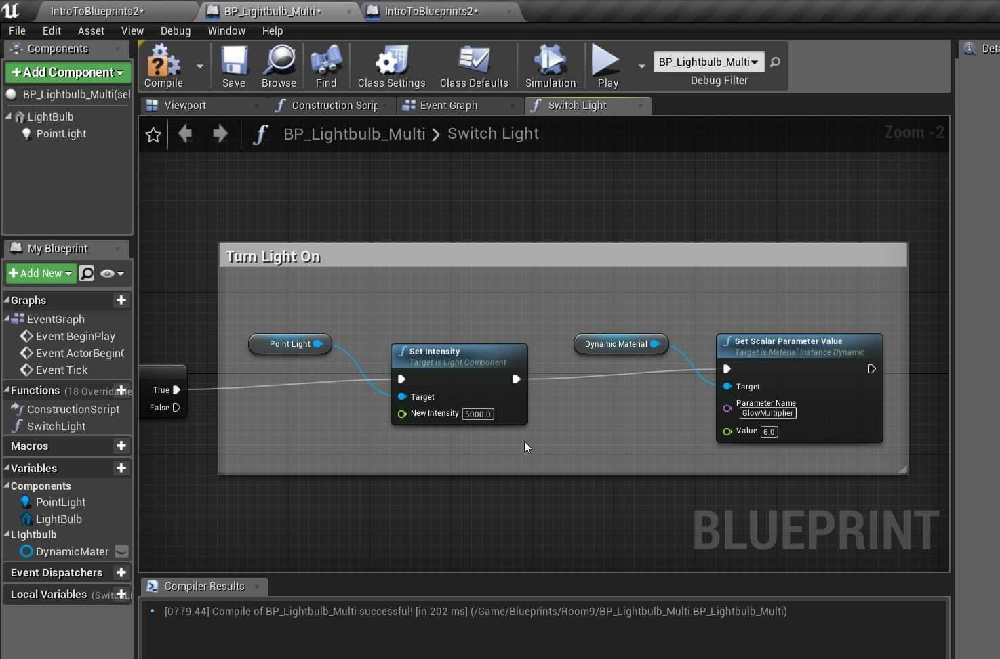

##### `Step 15.`\|`ITB`| :large_blue_diamond: :small_orange_diamond: 

*Copy and paste* all these nodes and change the comment to `Turn Light Off`. Set **New Intensity** and **Value** pins to `0.0`. *Connect* the **Set Intensity** execution pin to the **False** branch in the **Switch** node.

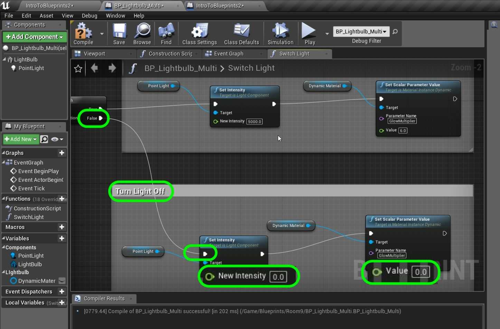

##### `Step 16.`\|`ITB`| :large_blue_diamond: :small_orange_diamond:   :small_blue_diamond: 

Lets test this function before moving forward. Go back to the **Event Graph** and add a function call by *right clicking* and adding a **Switch Light** node and connect it to begin play. *Play* the game with the **Turn On** boolean set to `false`. *Play* it in game and the lights should be off. Now do the same thing with the **Turn On** boolean set to `True`. *Run* the game the light should be on. Once you get this working *DELETE* the Switch Light node as we will be turning it on and off in another blueprint entirely.

##### `Step 17.`\|`ITB`| :large_blue_diamond: :small_orange_diamond: :small_blue_diamond: :small_blue_diamond:

In previous rooms we have put the trigger volume in the blueprint. In most cases we would have a trigger volum set in the level as it is always in a different place in the level and can sometimes control more than one blueprint. Go to **Volumes** and *drag* a **Trigger Volume **into the level. *Scale* it to add a box in front of the ligths so the player can walk into and out of it to trigger a lights on / lights off event.

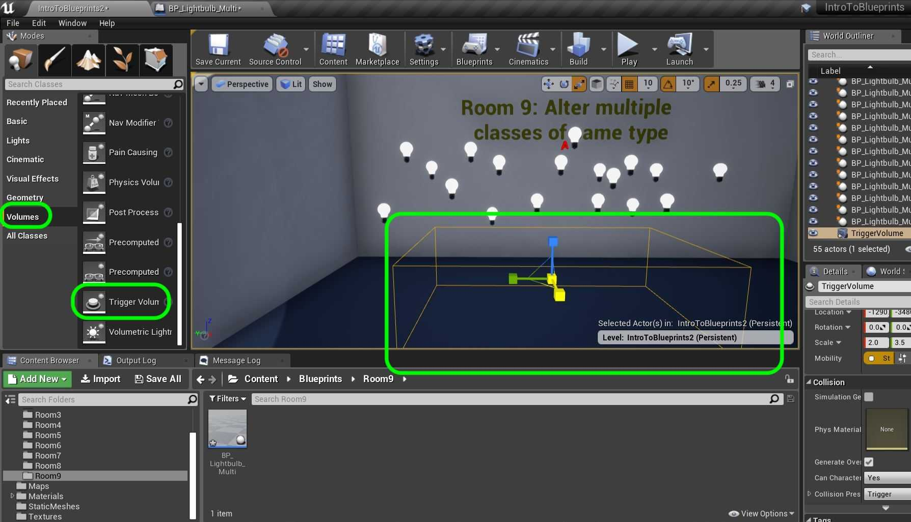

##### `Step 18.`\|`ITB`| :large_blue_diamond: :small_orange_diamond: :small_blue_diamond: :small_blue_diamond: :small_blue_diamond:

Now do we get access to any object that is in the room? This is easy go to the game and select the **Trigger Volume** you just selected.

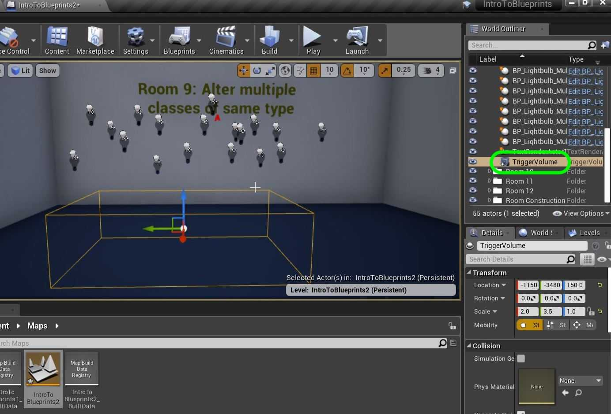

##### `Step 19.`\|`ITB`| :large_blue_diamond: :small_orange_diamond: :small_blue_diamond: :small_blue_diamond: :small_blue_diamond: :small_blue_diamond:

Now since a blueprint can be used in any level and that this trigger is unique to this level, there is a special kind of blueprint. Everytime you have created a new Map or Level the game has automatically created a [Level Blueprint](https://docs.unrealengine.com/4.26/en-US/ProgrammingAndScripting/Blueprints/UserGuide/Types/LevelBlueprint/). This blueprint gives you access to all the insances included in that level in the editor. 

> A Level Blueprint is a specialized type of Blueprint that acts as a level-wide global event graph. Each level in your project has its own Level Blueprint created by default that can be edited within the Unreal Editor, however new Level Blueprints cannot be created through the editor interface.  Events pertaining to the level as a whole, or specific instances of Actors within the level, are used to fire off sequences of actions in the form of Function Calls or Flow Control operations. - UE4 manual

Press the **Blueprints** button and select **Open Level Blueprint**. Please note that these *do not* show up in your Content folder as they can't be deleted. Their location is essentially hidden.

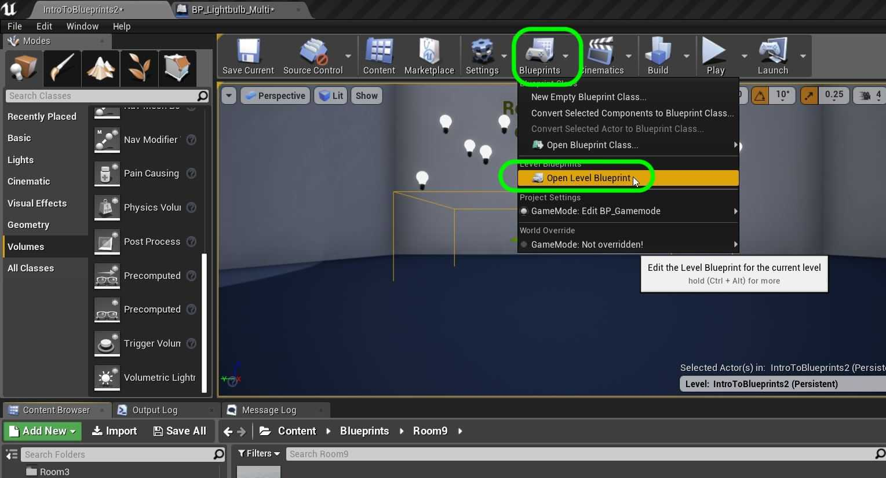

##### `Step 20.`\|`ITB`| :large_blue_diamond: :large_blue_diamond:

*Add* a new **Variable** and make it **Variable Type** of **BP Lightbulb Multi | Object Reference** and call it `Lightbulb Reference` and make it **Private**. What is the difference between **Object Reference** and **Class Reference**? The latter refers to the class as a whole and the **Object Reference** refers to each instance that is running. In this case we want to access each individual instance seperately. Next to **Variable** type *click* on the icon and select the grid to store an array of all lightbulbs.

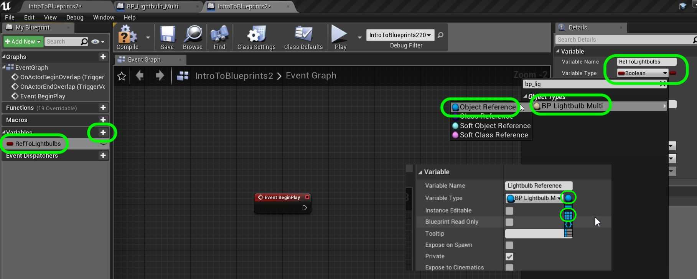

##### `Step 21.`\|`ITB`| :large_blue_diamond: :large_blue_diamond: :small_blue_diamond:

Now we need to get all the instances of the lightbulbs in the room. Add an **Event Begin Play** node. Right click and add a **Get All Actors of Class**. When you see a node that has **Get All** you know that it will most likely output an array of values.

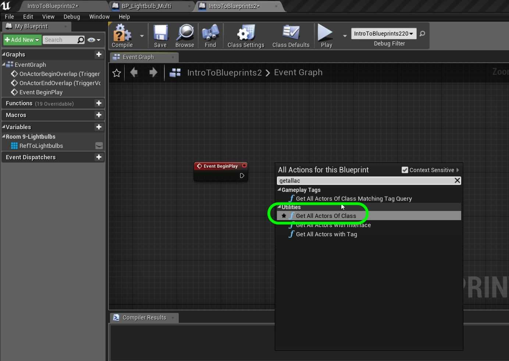

___

| [previous](../translation/README.md#user-content-translation)| [home](../README.md#user-content-ue4-blueprints) | [next](../multiple-actors-ii/README.md#user-content-dynamically-alter-multiple-classes-ii)|
|---|---|---|
