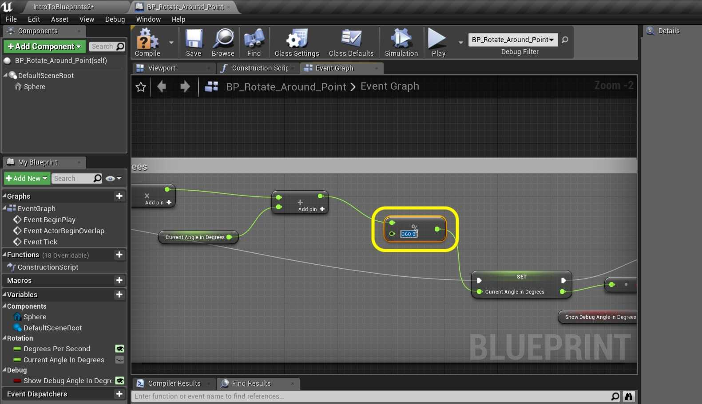
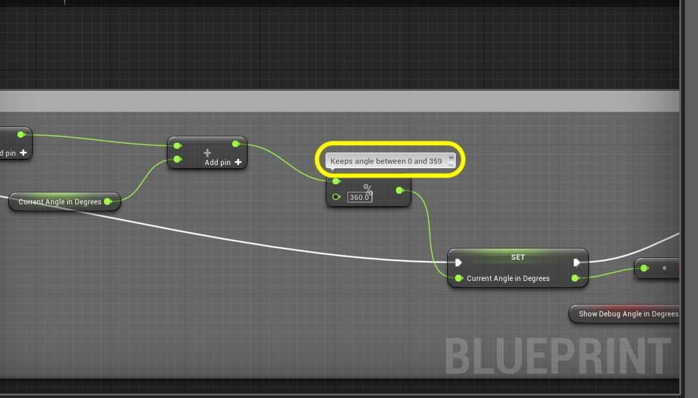
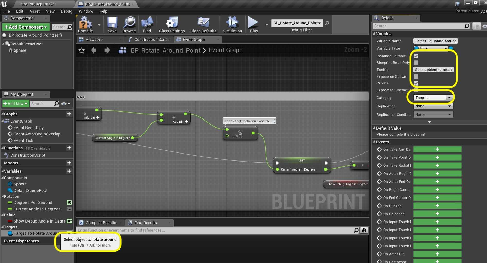
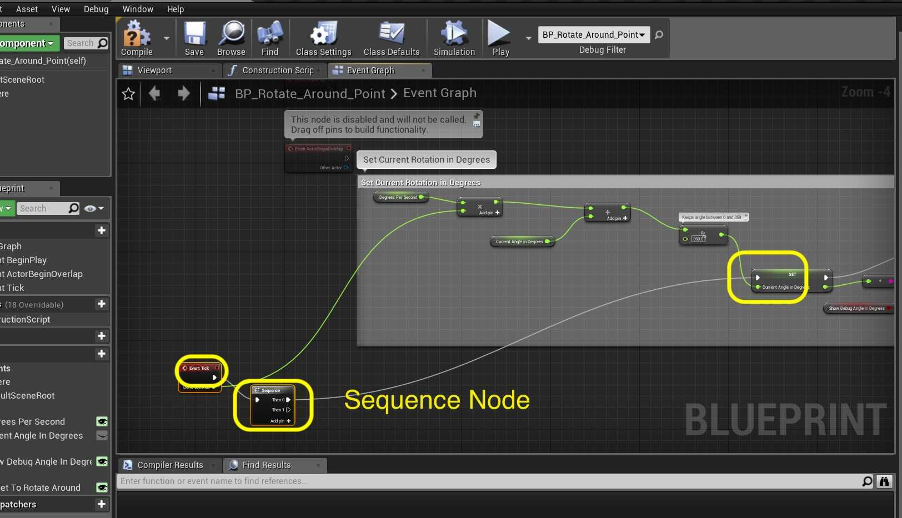
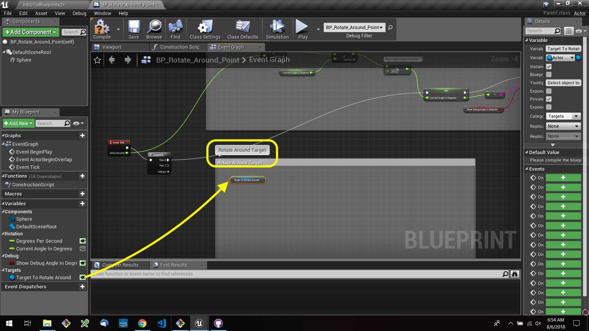
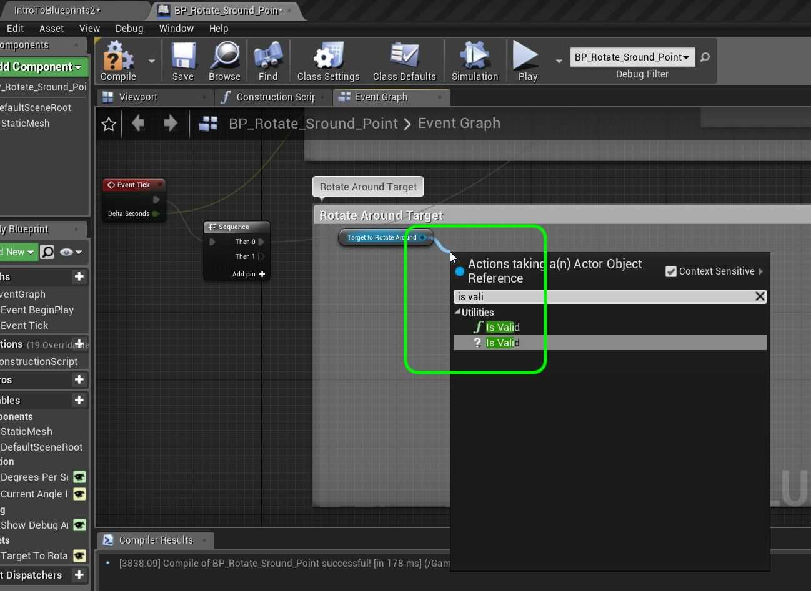
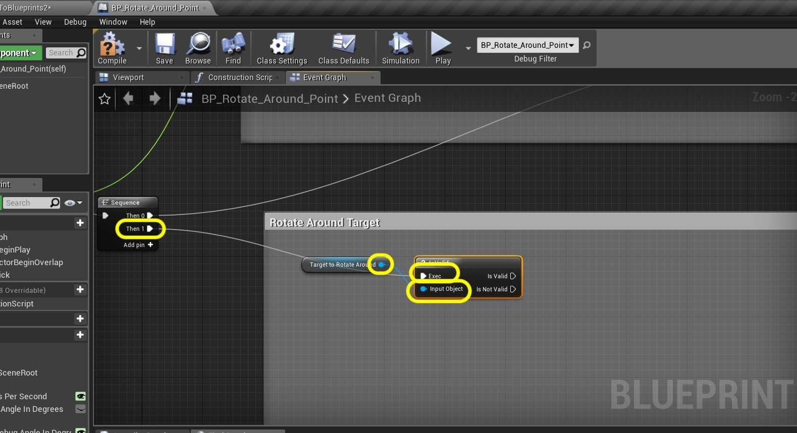

### Orbiting Actors II

[previous](../orbiting-actors/README.md#user-content-orbiting-actors) • [home](../README.md#user-content-ue4-blueprints) • [next](../orbiting-actors-iii/README.md#user-content-orbiting-actors-iii)

Orbiting actors continued.

 

---

##### `Step 1.`\|`ITB`|:small_blue_diamond:

*Place* the node so that it is between the **Addition** node and **Set** node. *Connect* the pins. *Change* the value you are taking the remainder of and set it to `360`. This will return a remainder between 0 and 359 (which is what we want).

##### `Step 2.`\|`FHIU`|:small_blue_diamond: :small_blue_diamond: 

You can also add a smaller comment on top of any node. If you click on the three dots that show up on the top left corner when you hover on the node you can adda comment. I added to the **Modulo** node `Keep angle between 0 and 359`.

##### `Step 3.`\|`ITB`|:small_blue_diamond: :small_blue_diamond: :small_blue_diamond:

*Run* in game and you will notice that the number always goes back to 0 when it passes 360. Perfect!

##### `Step 4.`\|`ITB`|:small_blue_diamond: :small_blue_diamond: :small_blue_diamond: :small_blue_diamond:

Now we need to rotate around the cube actor. We need a variable to access its class. Add a new **Variable**, call it `Target To Rotate Around` and select type **Actor | Object Reference**.

##### `Step 5.`\|`ITB`| :small_orange_diamond:

Make sure the **Instance Editable** is set to `true`, that the variable is **Private** and that the **Category** is set to `Targets`. Give the variable a **tooltip**:

##### `Step 6.`\|`ITB`| :small_orange_diamond: :small_blue_diamond:

To keep our graph neat we will put the rotation nodes under the current group. Lets *add* a **Sequence Node**. *Highjack* the output of the **Tick** node to the input of the **Sequence** node. Then attach the **Then 0** output to the **Set** node.

##### `Step 7.`\|`ITB`| :small_orange_diamond: :small_blue_diamond: :small_blue_diamond:

*Drag and drop* the **Target To Rotate Around** variable under the other nodes and select **Get**. Put a large comment box around it saying `Rotate Around Target`.

##### `Step 8.`\|`ITB`| :small_orange_diamond: :small_blue_diamond: :small_blue_diamond: :small_blue_diamond:

Now this is a pointer to a game object that you need to assign in the world editor. Whenever we point to an object we should test for a NULL pointer (pointing to an object in a memory address that does not exist yet). *Pull off* of the **Target to Rotate Around** node and select a **Utilities | ? Is Valid** (be careful there are many different is valid nodes) node:

##### `Step 9.`\|`ITB`| :small_orange_diamond: :small_blue_diamond: :small_blue_diamond: :small_blue_diamond: :small_blue_diamond:

Connect the **Then 1** output of the **Sequence** node execution pin to the execution input in the **Is Valid** pin. Make sure the variable output is connected to the **Input Object** pin on the **Is Valid** node:

##### `Step 10.`\|`ITB`| :large_blue_diamond:

##### `Step 11.`\|`ITB`| :large_blue_diamond: :small_blue_diamond: 

##### `Step 12.`\|`ITB`| :large_blue_diamond: :small_blue_diamond: :small_blue_diamond: 

##### `Step 13.`\|`ITB`| :large_blue_diamond: :small_blue_diamond: :small_blue_diamond:  :small_blue_diamond: 

##### `Step 14.`\|`ITB`| :large_blue_diamond: :small_blue_diamond: :small_blue_diamond: :small_blue_diamond:  :small_blue_diamond: 

##### `Step 15.`\|`ITB`| :large_blue_diamond: :small_orange_diamond: 

##### `Step 16.`\|`ITB`| :large_blue_diamond: :small_orange_diamond:   :small_blue_diamond: 

##### `Step 17.`\|`ITB`| :large_blue_diamond: :small_orange_diamond: :small_blue_diamond: :small_blue_diamond:

##### `Step 18.`\|`ITB`| :large_blue_diamond: :small_orange_diamond: :small_blue_diamond: :small_blue_diamond: :small_blue_diamond:

##### `Step 19.`\|`ITB`| :large_blue_diamond: :small_orange_diamond: :small_blue_diamond: :small_blue_diamond: :small_blue_diamond: :small_blue_diamond:

##### `Step 20.`\|`ITB`| :large_blue_diamond: :large_blue_diamond:

##### `Step 21.`\|`ITB`| :large_blue_diamond: :large_blue_diamond: :small_blue_diamond:

___

| [previous](../orbiting-actors/README.md#user-content-orbiting-actors)| [home](../README.md#user-content-ue4-blueprints) | [next](../orbiting-actors-iii/README.md#user-content-orbiting-actors-iii)|
|---|---|---|
