### User Input III

[previous](../user-input-ii/README.md#user-content-user-input-ii) • [home](../README.md#user-content-ue4-blueprints)

User input continued...

 

---

##### `Step 1.`\|`ITB`|:small_blue_diamond:

Connect the output of the **Set Current Angle Deg** node to the input of the **Set Relative Rotation** node's **New Rotation Z (Yaw)** pin:

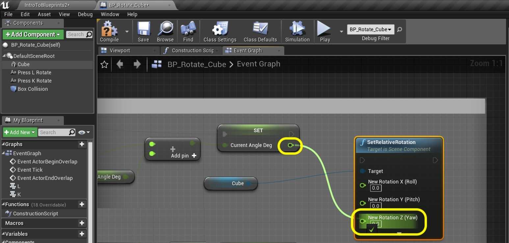

##### `Step 2.`\|`FHIU`|:small_blue_diamond: :small_blue_diamond: 

Connect the execution pins.

##### `Step 3.`\|`ITB`|:small_blue_diamond: :small_blue_diamond: :small_blue_diamond:

Adjust the default Speed of Rotation variable to 45.0 and press the <kbd>Compile</kbd> button. *Press* the <kbd>Compile</kbd> button.

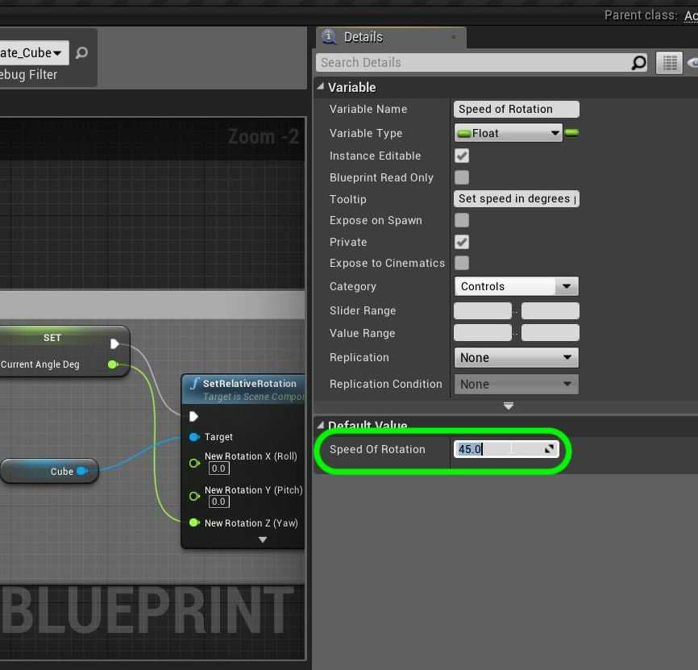

##### `Step 4.`\|`ITB`|:small_blue_diamond: :small_blue_diamond: :small_blue_diamond: :small_blue_diamond:

*Run* it in game to test if clockwise works. Run into the box and press L (or K for that matter). Hmmm nothing happens.

##### `Step 5.`\|`ITB`| :small_orange_diamond:

Now for an actor to read player controls (something normally reserved for a **Pawn** or **Character** blueprint we need to tell the game engine to add that ability to the actor). We also want it to not work when we are not in the collision volume. To the right of the two **Toggle Visibility** nodes *add* a **Get Player Controller** node.

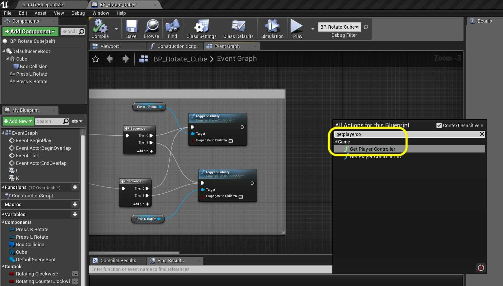

##### `Step 6.`\|`ITB`| :small_orange_diamond: :small_blue_diamond:

This is a class that we have not customized but default is used in the game (you will see it in the **World Outliner** when running the game). Since this simulation of for a single player controller we will leave **Player Index** at `0`. If this was a multiplayer game we woudl have to indicate which player this action was associated with. Drag off of the **Return Value** pin and select an **Enable Input** node:

##### `Step 7.`\|`ITB`| :small_orange_diamond: :small_blue_diamond: :small_blue_diamond:

Now we don't want to pull off of the **Toggle Visibility** execution pins as this gets called every time and handles toggling on and off. Connect these to the **Begin Play** execution node. *Press* the <kbd>Compile</kbd> button.

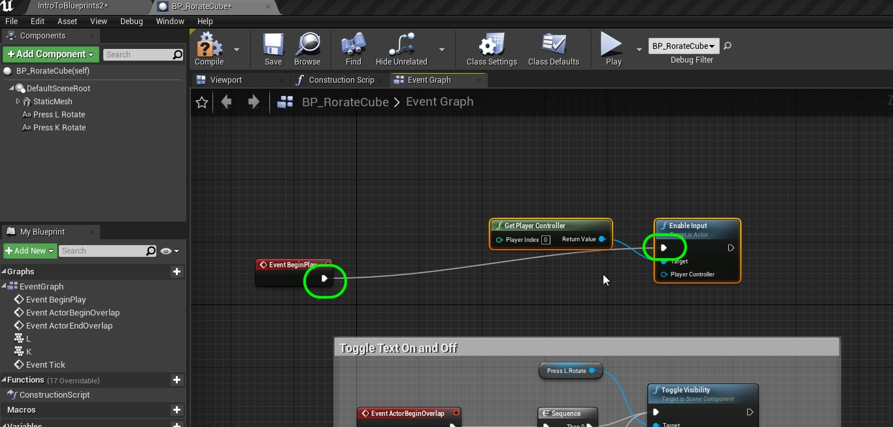

##### `Step 8.`\|`ITB`| :small_orange_diamond: :small_blue_diamond: :small_blue_diamond: :small_blue_diamond:

Now go to the game and select the **BP_RotateCube** instance in the level and change the **Auto Receive Input** to `Player 0`.

##### `Step 9.`\|`ITB`| :small_orange_diamond: :small_blue_diamond: :small_blue_diamond: :small_blue_diamond: :small_blue_diamond:

Now *run* it in game and the cube should rotate clockwise when you press the <kbd>L</kbd> key.

##### `Step 10.`\|`ITB`| :large_blue_diamond:

Lets add counter clockwise movement. Now we need to add two nodes a **Get Rotating Counter Clockwise** and **Branch** . This checks to see if the counter clockwise <kbd>K</kbd> button is pressed. Connect the execution pin from **Sequence | Then1** to the **Branch** node.  Connect the **RotatingCounterClockwise** pin to the **Branch | Condition** pin. 

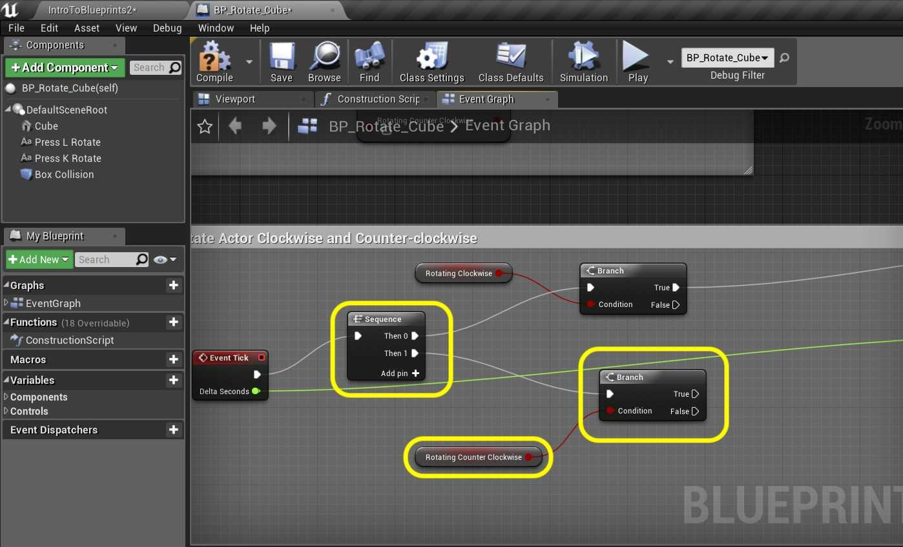

##### `Step 11.`\|`ITB`| :large_blue_diamond: :small_blue_diamond: 

Now the only difference for counter clockwise movement is that the rotation is negative. So *highjack* the output of the **Multiplication** output and add a **Float * Float** node beneath.

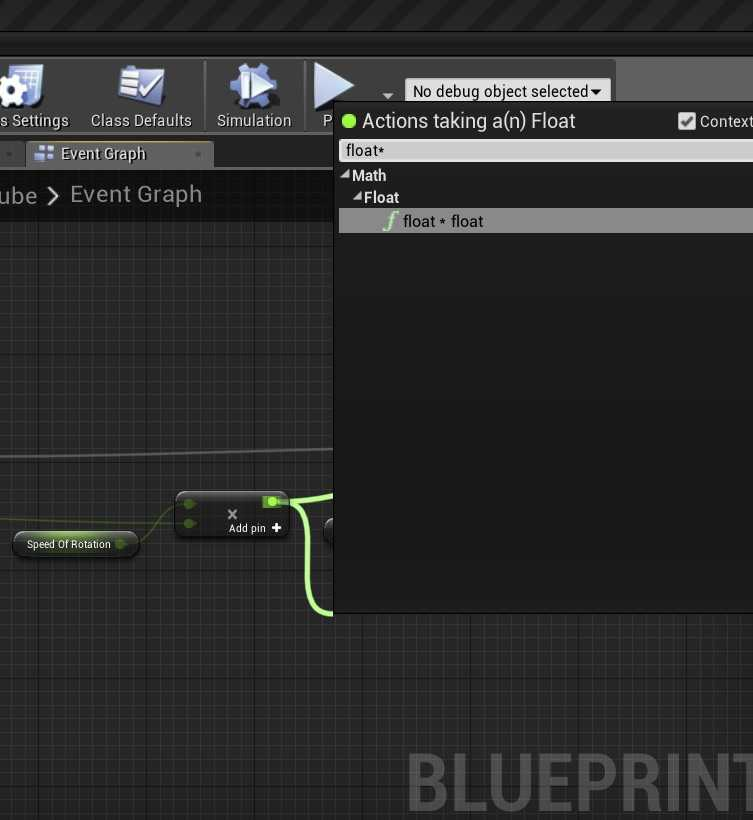

##### `Step 12.`\|`ITB`| :large_blue_diamond: :small_blue_diamond: :small_blue_diamond: 

Multiply this number by `-1.0`

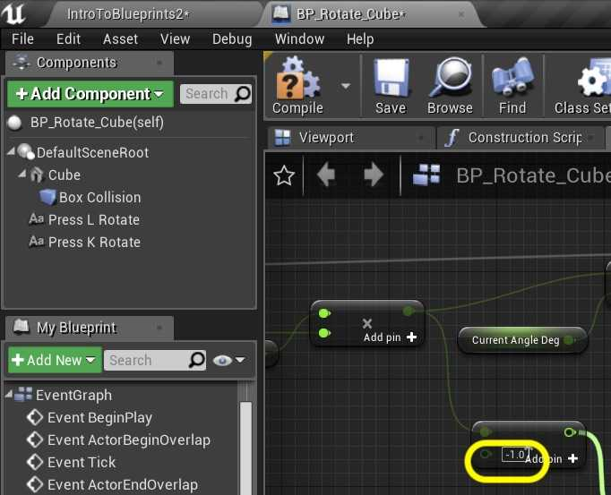

##### `Step 13.`\|`ITB`| :large_blue_diamond: :small_blue_diamond: :small_blue_diamond:  :small_blue_diamond: 

*Copy and paste* the Get **Current Angle Deg**, **Addition** and **Set Current Angle Deg** nodes and paste below. *Connect* the output of the **Multiplication** by -1 node to the input of the **+** node. *Connect* the **Execution** pin of the **Branch | True** node to the execution pin of the **Set Current Angle Deg** node.

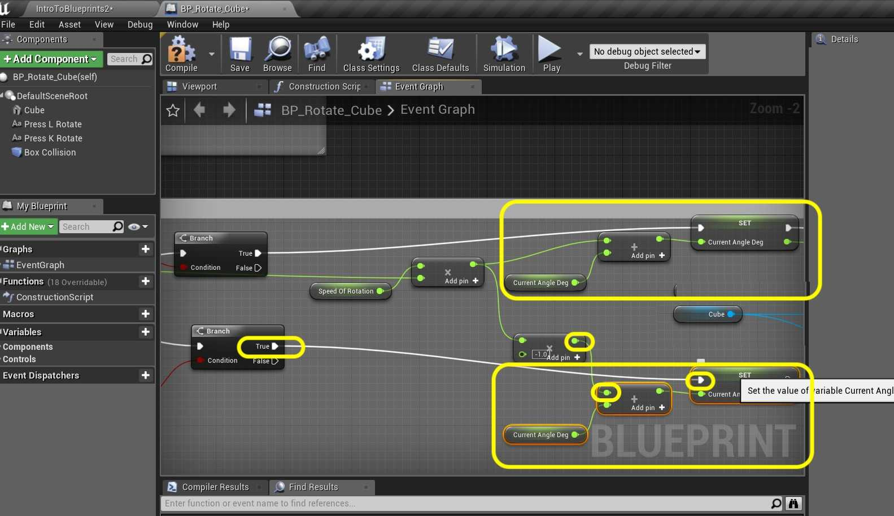

##### `Step 14.`\|`ITB`| :large_blue_diamond: :small_blue_diamond: :small_blue_diamond: :small_blue_diamond:  :small_blue_diamond: 

Copy and paste the **Set Relative Rotation** node and *connect* the output of the second **Set** node to the **New Rotation Z (Yaw)** pin of this node.

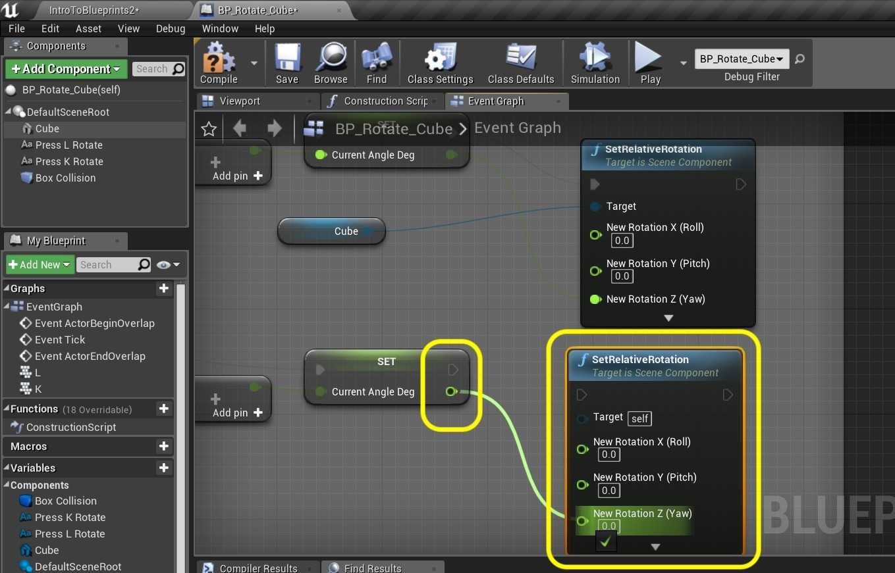

##### `Step 15.`\|`ITB`| :large_blue_diamond: :small_orange_diamond: 

Since we are targetting just the **Static Mesh** by connecting to the **Set Relative Rotation | Target**. *Connect* the **Set Current Angle Deg** execution pin to **Set Relative Rotation**. *Press* the <kbd>Compile</kbd> button.

##### `Step 16.`\|`ITB`| :large_blue_diamond: :small_orange_diamond:   :small_blue_diamond: 

*Run* the game and test it. Now it works OK as the <kbd>L</kbd> and <kbd>K</kbd> button both work. But there is a design flaw. What I press the L button while pressing the K button without releasing it. Now two booleans are true and they cancel each other out. I want to cancel the other rotation as soon as a new one is detected.

##### `Step 17.`\|`ITB`| :large_blue_diamond: :small_orange_diamond: :small_blue_diamond: :small_blue_diamond:

So in the Button Events add a **Set Rotating Counter Clockwise** to `false` after the <kbd>L</kbd> button is pressed and a **Set Rotating Clockwise** to `false` when the <kbd>K</kbd> button is pressed. *Press* the <kbd>Compile</kbd> button.

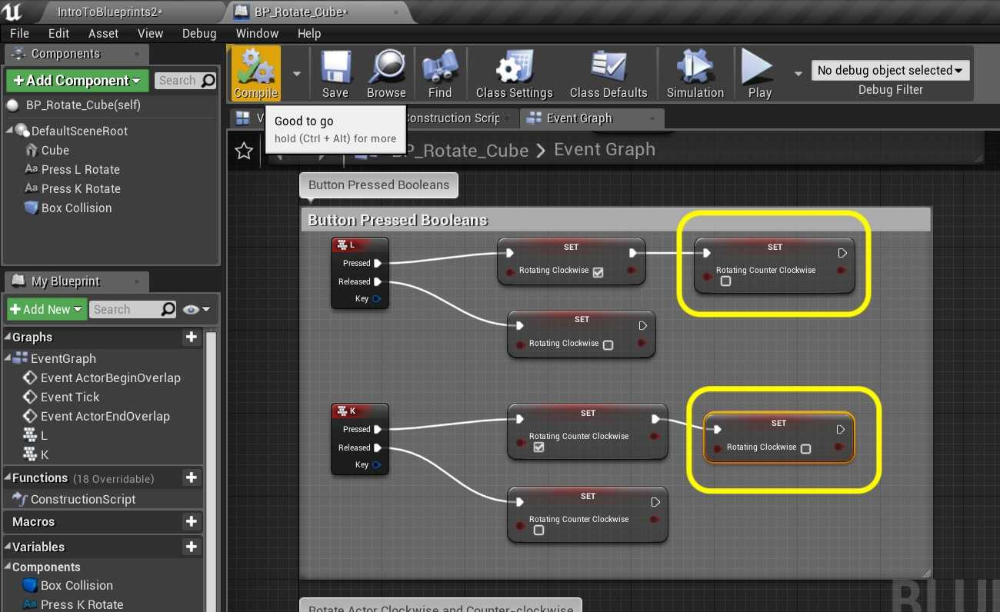

##### `Step 18.`\|`ITB`| :large_blue_diamond: :small_orange_diamond: :small_blue_diamond: :small_blue_diamond: :small_blue_diamond:

Now *run* the game and walk into the collision volume. This should finish up this room.

##### `Step 19.`\|`ITB`| :large_blue_diamond: :small_orange_diamond: :small_blue_diamond: :small_blue_diamond: :small_blue_diamond: :small_blue_diamond:

That's it for **Room 12** and this entire level and walk through. *Press* **Save All** and update **Github** by committing and pushing all the changes made.

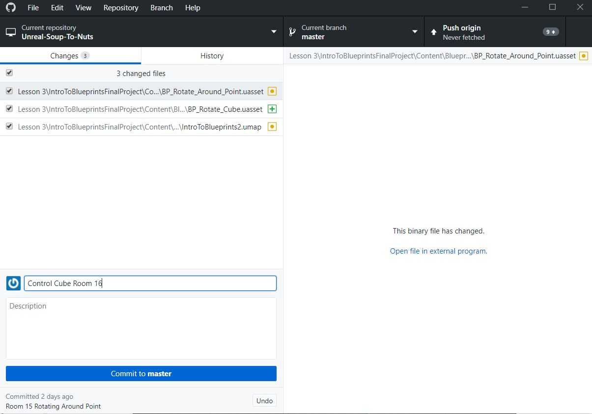

| `intro.blueprints`\|`THE END`| 
| :--- |
| **That's All Folks!** Thanks for sticking around. That's it for this lesson. |

| [previous](../user-input-ii/README.md#user-content-user-input-ii)| [home](../README.md#user-content-ue4-blueprints) |
|---|---|
