### User Input

[previous](../orbiting-actors-iv/README.md#user-content-orbiting-actors-iv) • [home](../README.md#user-content-ue4-blueprints) • [next](../)

Lets add user input to a basic **Actor** class. We will be using the **L** and **K** button to rotate a cube.

 

---

##### `Step 1.`\|`ITB`|:small_blue_diamond:

*Add* a new **Blueprints | Room12** folder. *Create* a new **Blueprint Class** of base **Actor**. Call it `BP_RotateCube.`

##### `Step 2.`\|`FHIU`|:small_blue_diamond: :small_blue_diamond: 

Add a **Static Mesh** component to the blueprint. Call it `Cube`. Assign the **Static Mesh** `Cube` (you need to turn on **Engine Assets**) and **Material** `M_Metal_Burnished_Steel`.

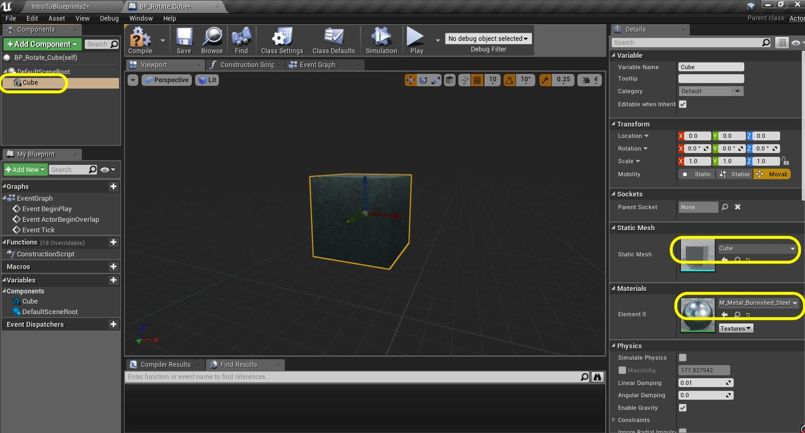

##### `Step 3.`\|`ITB`|:small_blue_diamond: :small_blue_diamond: :small_blue_diamond:

*Add* a **Box Collision** *Component* and make the **Box Extent** `200.0`, `600.0`, `100.0`. *Move* the collider in behind the box (opposite of **Red X** axis ).

##### `Step 4.`\|`ITB`|:small_blue_diamond: :small_blue_diamond: :small_blue_diamond: :small_blue_diamond:

Add **BP_Rotate_Cube** to the **Room 12** and center it. Make sure the collision box is in front of cube.

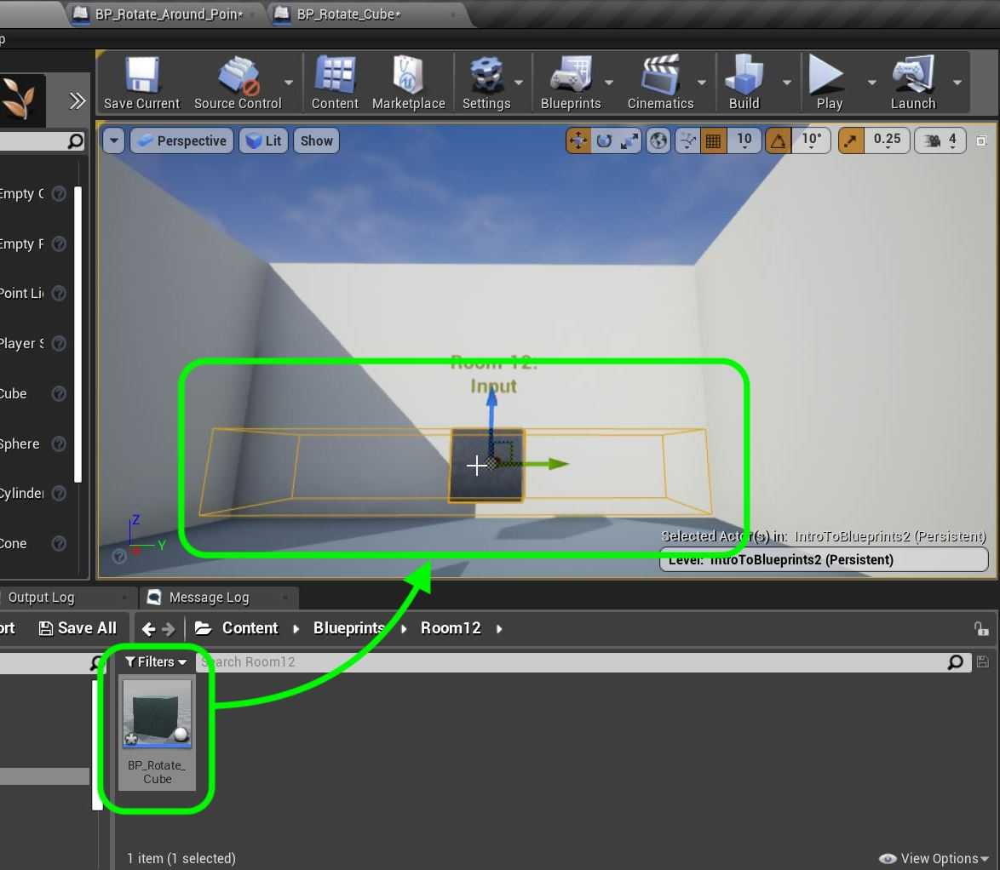

##### `Step 5.`\|`ITB`| :small_orange_diamond:

For housekeeping move this game object into the **Room 12** folder:

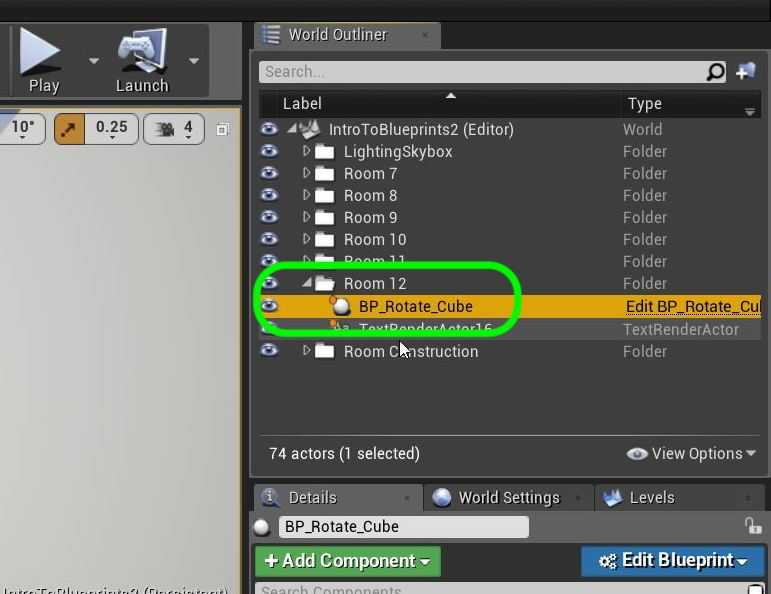

##### `Step 6.`\|`ITB`| :small_orange_diamond: :small_blue_diamond:

*Add* a **Text Renderer** component to the blueprint.

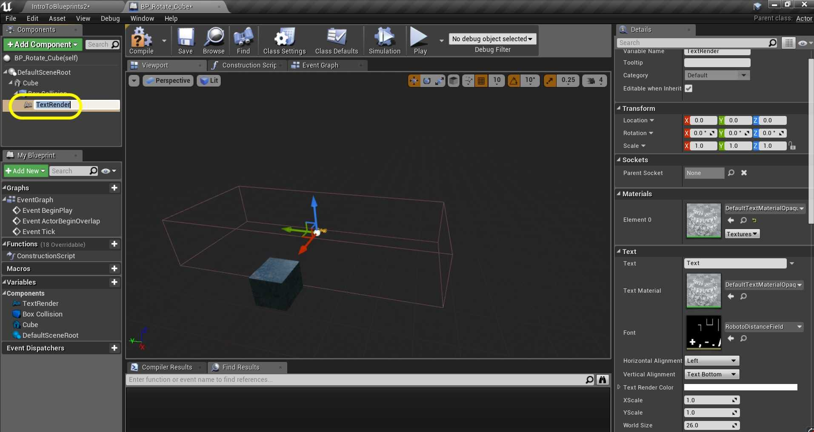

##### `Step 7.`\|`ITB`| :small_orange_diamond: :small_blue_diamond: :small_blue_diamond:

Change the **Text** to `Press L Key to Rotate Clockwise`. I had to rotate the component by `180` degrees on the **Z** axis to face forward. *Change* **Horizontal Alignment** to `Center` and adjust the **Text Render Color** to contrast with the background. *Select* a larger font size as well! Move text above cube.

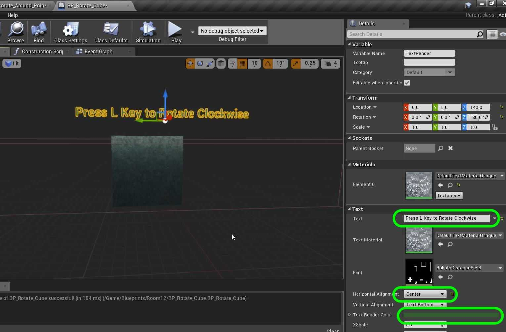

##### `Step 8.`\|`ITB`| :small_orange_diamond: :small_blue_diamond: :small_blue_diamond: :small_blue_diamond:

Right click on **Press L Rotate** Component and press *Duplicate*. Call the new component `Press K Rotate`.

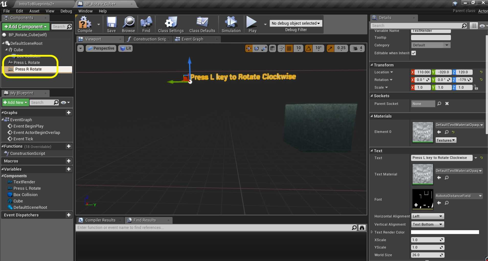

##### `Step 9.`\|`ITB`| :small_orange_diamond: :small_blue_diamond: :small_blue_diamond: :small_blue_diamond: :small_blue_diamond:

Change the **Text** to `Press K Key to Rotate Counter Clockwise`. Adjust the location to be below the *L key* text component:

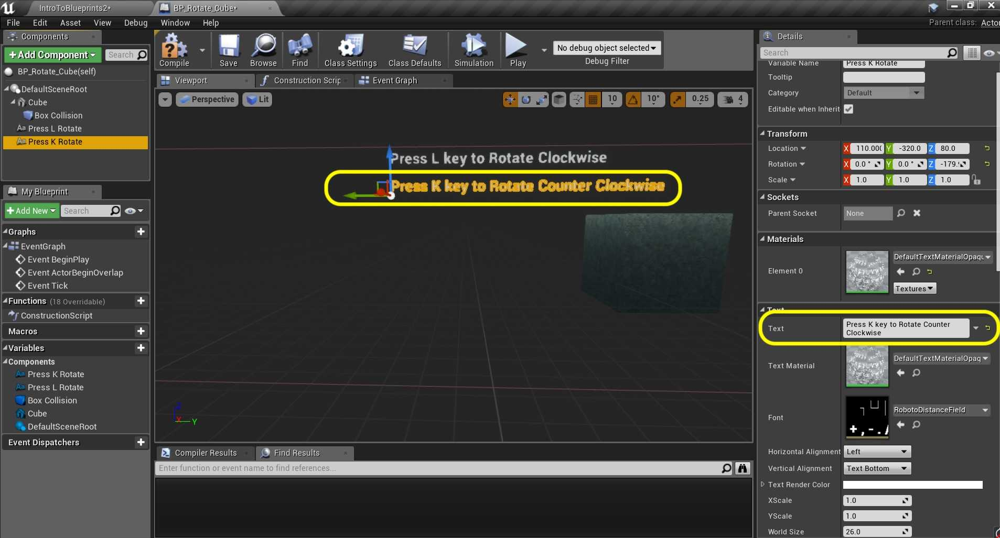

##### `Step 10.`\|`ITB`| :large_blue_diamond:

Go to the game and hit **run**. Look and see if you are happy with the position. Make any size adjustments you need to. 

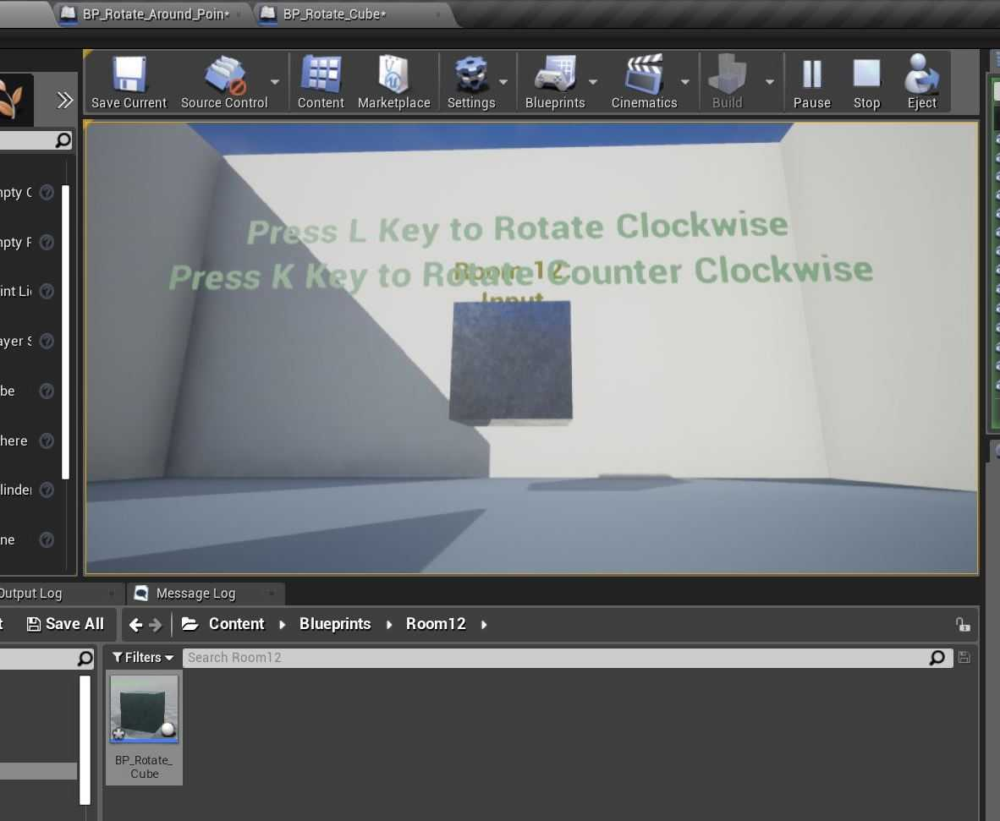

##### `Step 11.`\|`ITB`| :large_blue_diamond: :small_blue_diamond: 

Go to the **Event Graph** and *pull off* of the **Event Actor Begin Overlap** and *drag off* off the execution pin. *Select* a **Sequence** node:

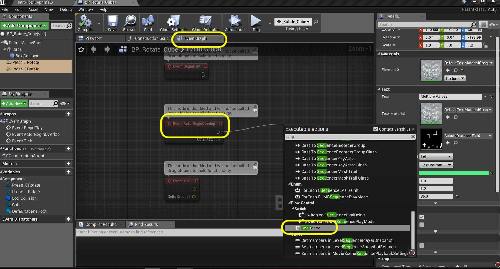

##### `Step 12.`\|`ITB`| :large_blue_diamond: :small_blue_diamond: :small_blue_diamond: 

*Drag* off of the execution pin from the **Sequence Then 0** pin and select **Toggle Visibility (Press L Rotate)**.

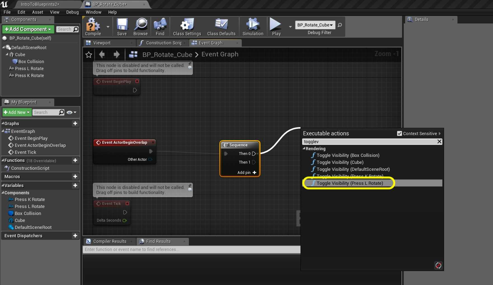

##### `Step 13.`\|`ITB`| :large_blue_diamond: :small_blue_diamond: :small_blue_diamond:  :small_blue_diamond: 

*Drag* off of the execution pin from the **Sequence Then 1** pin and select **Toggle Visibility (Press K Rotate)**.

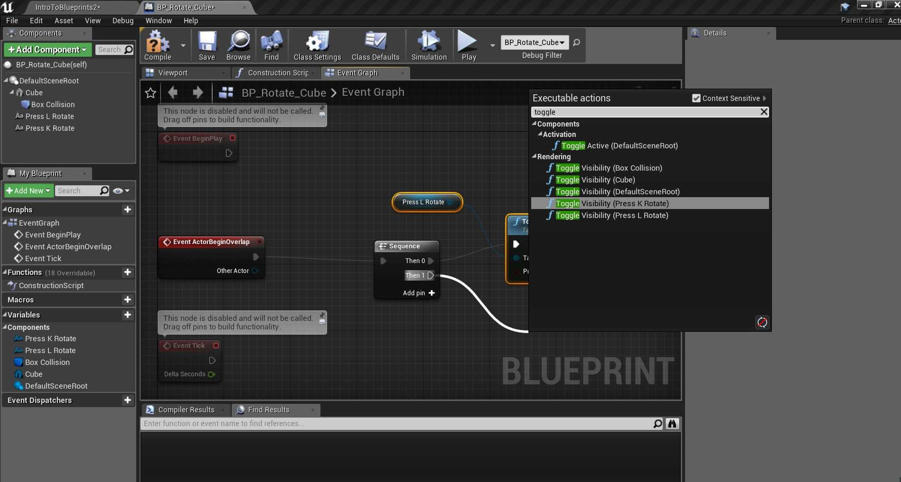

##### `Step 14.`\|`ITB`| :large_blue_diamond: :small_blue_diamond: :small_blue_diamond: :small_blue_diamond:  :small_blue_diamond: 

*Right click* on the empty graph and select the **Event Actor End Overlap** node.

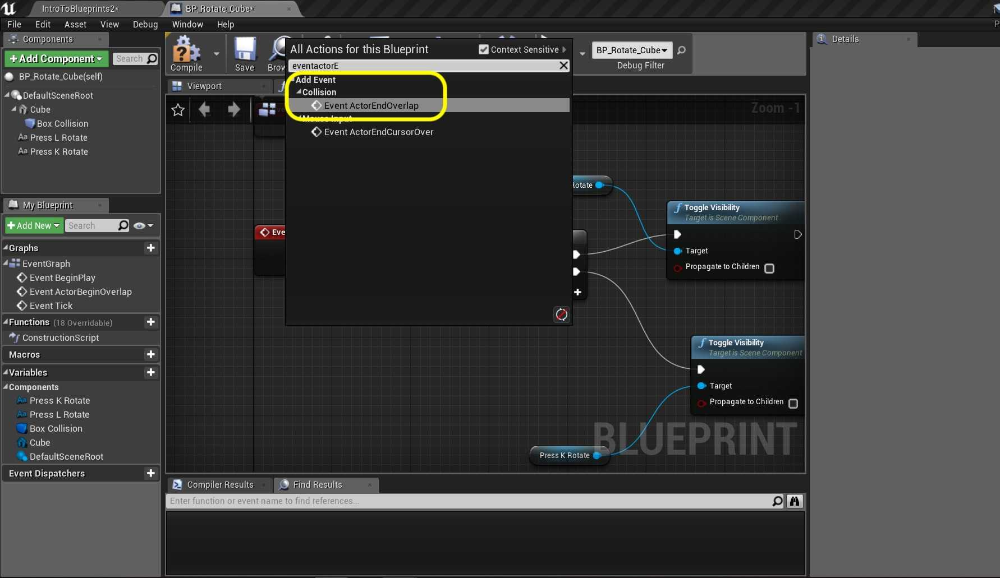

##### `Step 15.`\|`ITB`| :large_blue_diamond: :small_orange_diamond: 

*Pull off* the execution pin and select another **Sequence** node. *Connect* the outputs of the **Sequence** nodes to the two **Toggle Visibility** nodes:

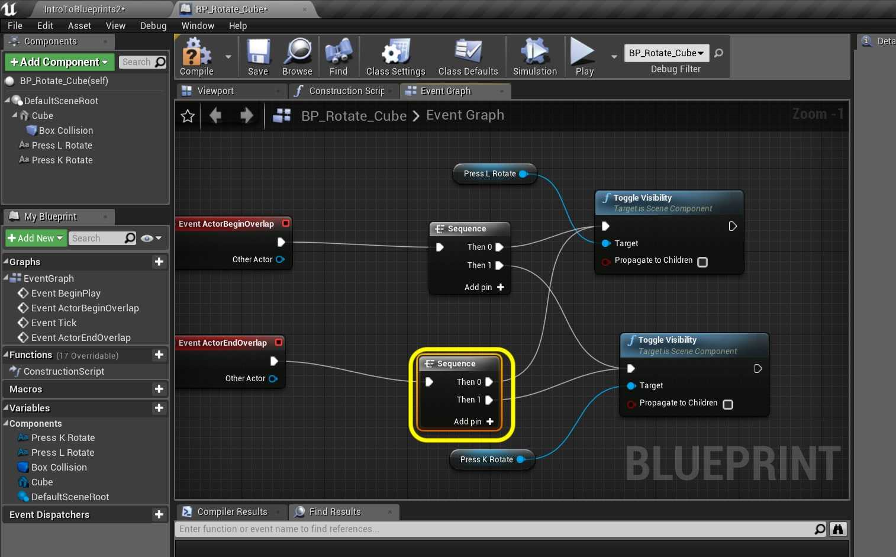

##### `Step 16.`\|`ITB`| :large_blue_diamond: :small_orange_diamond:   :small_blue_diamond: 

Add a comment to this group of nodes called `Toggle Text On and Off`.

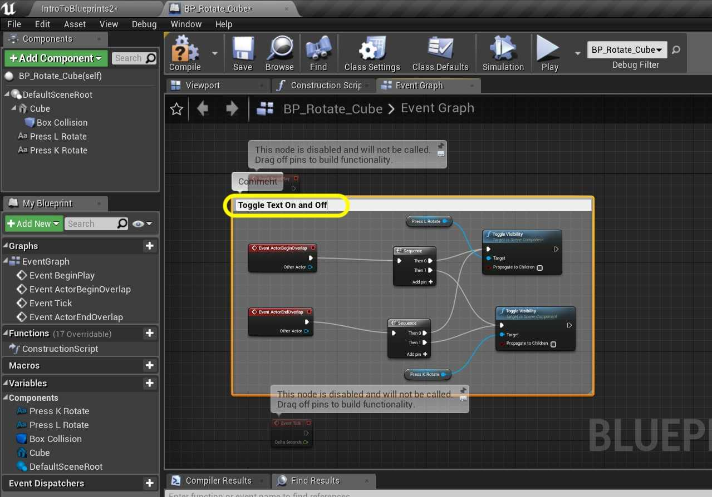

##### `Step 17.`\|`ITB`| :large_blue_diamond: :small_orange_diamond: :small_blue_diamond: :small_blue_diamond:

*Run* the game and walk into the collision volume. You will see that the algorithm is backwards. When you are inside the volume the text is off and on when you are outside the volume.

##### `Step 18.`\|`ITB`| :large_blue_diamond: :small_orange_diamond: :small_blue_diamond: :small_blue_diamond: :small_blue_diamond:

Just ensure that visibility is off when we start open the blueprint and make sure that **Visibility** is `False` on both text rendercomponents:

##### `Step 19.`\|`ITB`| :large_blue_diamond: :small_orange_diamond: :small_blue_diamond: :small_blue_diamond: :small_blue_diamond: :small_blue_diamond:

Now there is an event trigger for when a button is pressed and released. There is not a trigger for a button being held. So we will create a boolean that sets when a key is held. We need to add two booleans. 

*Add* a new **Boolean** variable called `bRotatingClockwise`, make it **Private** and set the **Category** to `Controls`. *Add* a **Tooltip** that says `Bool to tell us if clockwise button is pressed`.

##### `Step 20.`\|`ITB`| :large_blue_diamond: :large_blue_diamond:

Go to the **My Blueprints** panel and select the **Rotating Clockwise** with the *right mouse button* and select **Duplicate**:

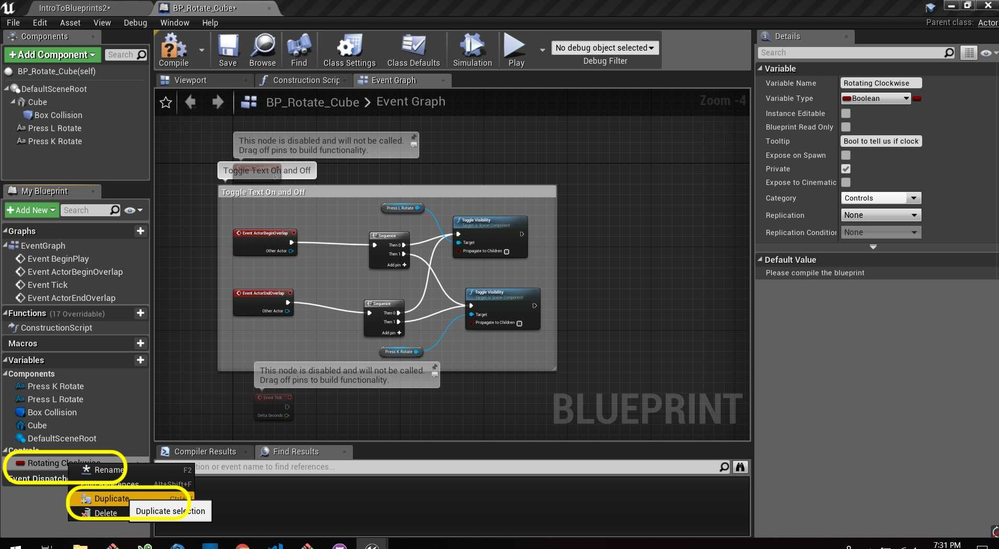

##### `Step 21.`\|`ITB`| :large_blue_diamond: :large_blue_diamond: :small_blue_diamond:

*Rename* the **Variable** to `RotatingCounterClockwise` and update the **Tooltip**:

___

| [previous](../orbiting-actors-iv/README.md#user-content-orbiting-actors-iv)| [home](../README.md#user-content-ue4-blueprints) | [next](../user-input-ii/README.md#user-content-user-input-ii)|
|---|---|---|
